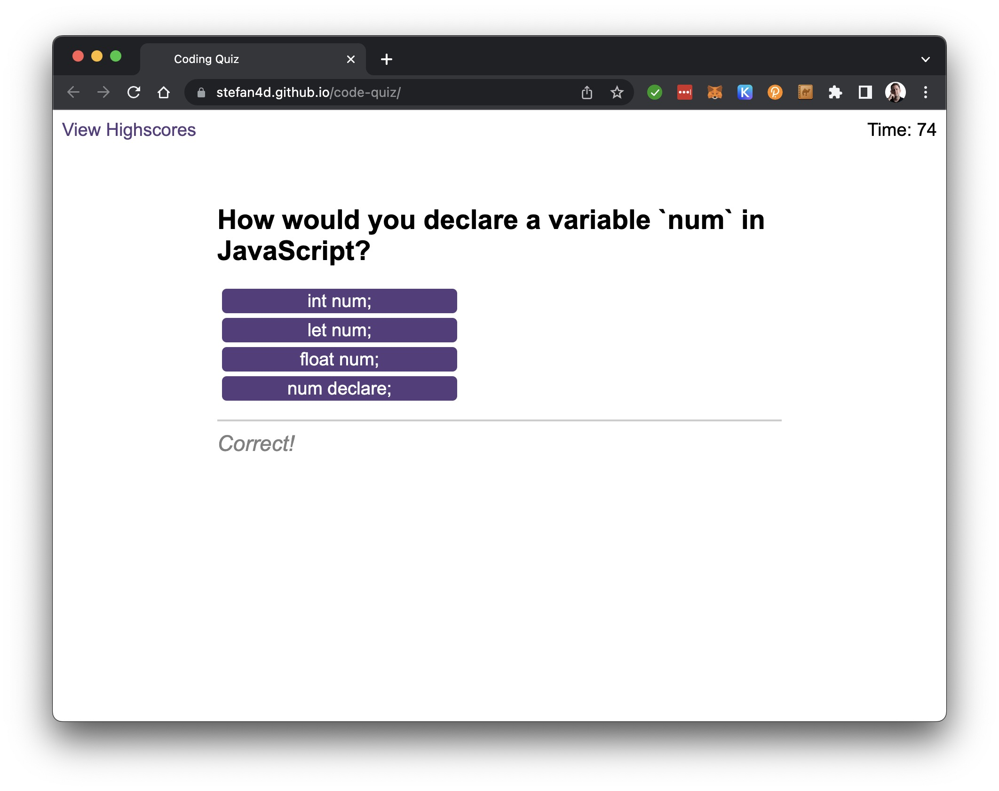

# Code Quiz

## Description

Submission for Module 6 of the University of Birmingham Skills Bootcamp in Front-End Web Development &amp; UX.

This assignment took a starter code package in commit [8a1f771](https://github.com/Stefan4D/code-quiz/commit/8a1f771cbfc36b423e746d917541ec1c5354b5a4) and developed it to meet the defined acceptance criteria.

The production website is deployed [here](https://stefan4d.github.io/code-quiz/).

This has been developed to meet the following Acceptance Criteria:

- GIVEN I am taking a code quiz
- WHEN I click the start button
- THEN a timer starts and I am presented with a question
- WHEN I answer a question
- THEN I am presented with another question
- WHEN I answer a question incorrectly
- THEN time is subtracted from the clock
- WHEN all questions are answered or the timer reaches 0
- THEN the game is over
- WHEN the game is over
- THEN I can save my initials and score

## Learning Outcomes

- Re-visited the use of default versus named exports and fixed an error where I was using a default export and importing using named syntax
- Practiced using the .classList.remove() method that had learned on a Net Ninja course previously
- Learned how to store and retrieve data with localStorage
- Learned how to sort an array of objects
- Learned that the forEach method also has an index argument / parameter that holds the index within the input array of the current element
- Learned about moving variables into and out of global scope to make them available across different function in my program to achieve the desired behaviour
- Learned about using .matches() to see if an element matches a CSS selector, which I used to only target buttons within the choices div. I also learned this is called event delegation.
- Learned how to create audio elements offscreen and how to play them in response to an event

## Resources used

- [Solved: Import Error](https://www.sharooq.com/solved-attempted-import-error-something-is-not-imported-from-some-file)
- [How TO - JavaScript Countdown Timer](https://www.w3schools.com/howto/howto_js_countdown.asp)
- [MDN: classList](https://developer.mozilla.org/en-US/docs/Web/API/Element/classList)
- [MDN: localStorage](https://developer.mozilla.org/en-US/docs/Web/API/Window/localStorage)
- [Sort an array of objects](https://www.javascripttutorial.net/array/javascript-sort-an-array-of-objects/)
- [MDN: forEach](https://developer.mozilla.org/en-US/docs/Web/JavaScript/Reference/Global_Objects/Array/forEach)
- [Stack Overflow: Get loop counter/index using for…of syntax in JavaScript](https://stackoverflow.com/questions/10179815/get-loop-counter-index-using-for-of-syntax-in-javascript)
- [How to fade out an element in pure JavaScript](https://www.tutorialspoint.com/how-to-add-fade-out-effect-using-pure-javascript#:~:text=We%20can%20add%20a%20fade,once%20the%20opacity%20reaches%200.)
- [MDN: matches](https://developer.mozilla.org/en-US/docs/Web/API/Element/matches)
- Net Ninja: Modern JavaScript course (Udemy)

## Mark Scheme Compliance

### Technical Acceptance Criteria

| Item                                            | Evidence                                                                                                                                                     |
| ----------------------------------------------- | ------------------------------------------------------------------------------------------------------------------------------------------------------------ |
| Satisfies all of the above acceptance criteria. | The built application satisfies the acceptance criteria and comments are included in the code for the acceptance criteria and respective handling functions. |

### Deployment

| Item                                              | Evidence                                                            |
| ------------------------------------------------- | ------------------------------------------------------------------- |
| Application deployed at live URL.                 | Live application deployed at: https://stefan4d.github.io/code-quiz/ |
| Application loads with no errors.                 | No visual defects   No console errors                          |
| Application GitHub URL submitted.                 | URL submitted                                                       |
| GitHub repository that contains application code. | This repository contains all code.                                  |

### Application Quality

| Item                                                                                    | Evidence                                                                                                                        |
| --------------------------------------------------------------------------------------- | ------------------------------------------------------------------------------------------------------------------------------- |
| Application user experience is intuitive and easy to navigate.                          | Application uses standard web page elements and hides/displays elements of the UI depending on the current context of the game. |
| Application user interface style is clean and polished.                                 | Application user interface matches the original starter code.                                                                   |
| Application resembles the mock-up functionality provided in the Challenge instructions. | Application resembles the mock-up.                                                                                              |

### Repository Quality

| Item                                                                                                    | Evidence                                                                                                                                                                                                     |
| ------------------------------------------------------------------------------------------------------- | ------------------------------------------------------------------------------------------------------------------------------------------------------------------------------------------------------------ |
| Repository has a unique name.                                                                           | Unique name used                                                                                                                                                                                             |
| Repository follows best practices for file structure and naming conventions.                            | Standard file naming conventions used                                                                                                                                                                        |
| Repository follows best practices for class/id naming conventions, indentation, quality comments, etc.  | All multi-word variables used camelCase   Indentation within code follows best practice    Comments have been included within the files to describe behaviour and/or intent of the code. |
| Repository contains multiple descriptive commit messages.                                               | Multiple commits included demonstrating incremental build of final submission. Each has a clear description of changes made.                                                                                 |
| Repository contains quality README file with description, screenshot, and link to deployed application. | This README document.                                                                                                                                                                                        |

## License

Released under the MIT license. Full details in [LICENSE](./LICENSE).
